# Architectural Trade-offs in Small Language Models Under Compute Constraints

This repository contains code and experiments for a systematic empirical study of small language models under strict compute constraints, analyzing how architectural choices and training budget interact to determine performance.

**Paper**: [Architectural Trade-offs in Small Language Models Under Compute Constraints](https://arxiv.org/abs/2512.20877)

**Author**: Shivraj Singh Bhatti (ssbhatti@umass.edu)

## Overview

This project compares different language model architectures (Linear, MLP, Self-Attention, and Transformer) on character-level and word-level language modeling tasks. Starting from a simple linear next-token predictor, we progressively introduce nonlinearities, self-attention, and multi-layer transformer architectures, evaluating each on:

- **Character-level modeling**: Tiny Shakespeare dataset
- **Word-level modeling**: Penn Treebank (PTB) and WikiText-2 datasets

Models are compared using test negative log-likelihood (NLL), parameter count, and approximate training FLOPs to characterize accuracy-efficiency trade-offs.

## Key Findings

- **Attention-based models dominate MLPs** in per-FLOP efficiency even at small scale
- **Increasing depth or context without sufficient optimization** can degrade performance
- **Modern LLM techniques may not transfer** to small-model regimes (e.g., RoPE positional embeddings underperformed learned embeddings)
- **Nonlinear models dramatically outperform** the linear baseline
- **Capacity must match compute**: additional parameters need sufficient optimization steps

## Repository Structure

```
language_model_architecture_comparison/
├── language_model_architecture_comparison.ipynb  # Main Jupyter notebook with all experiments
├── datasets/                                      # Dataset files
│   ├── tiny_shakespeare/                         # Character-level dataset
│   ├── ptb/                                      # Penn Treebank (word-level)
│   └── wikitext-2/                               # WikiText-2 (word-level)
├── images/                                       # Generated plots and visualizations
│   ├── tiny_train_val_loss.png                  # Training curves for Tiny Shakespeare
│   ├── tiny_loss_vs_flops.png                   # Efficiency comparison
│   ├── ptb_loss.png                              # PTB training dynamics
│   ├── wikitext2_loss.png                       # WikiText-2 training dynamics
│   └── ...                                       # Additional hyperparameter sweep plots
└── README.md                                     # This file
```

## Setup

### Prerequisites

- Python 3.7+
- Jupyter Notebook
- CUDA-capable GPU (optional, but recommended for faster training)

### Installation

1. Clone this repository:
```bash
git clone https://github.com/shivraj-S-bhatti/language_model_architecture_comparison.git
cd language_model_architecture_comparison
```

2. Install required dependencies:
```bash
pip install torch numpy matplotlib jupyter
```

Or using conda:
```bash
conda install pytorch numpy matplotlib jupyter -c pytorch
```

## Usage

### Running Experiments

1. Open the Jupyter notebook:
```bash
jupyter notebook language_model_architecture_comparison.ipynb
```

2. The notebook is organized into sections:
   - **Data Loading**: Loads and tokenizes Tiny Shakespeare dataset
   - **Model Definitions**: Implements Linear, MLP, Self-Attention, and Transformer architectures
   - **Training**: Trains each model with appropriate hyperparameters
   - **Hyperparameter Sweeps**: Explores context length, hidden dimensions, attention heads, and layer depth
   - **Evaluation**: Computes test NLL, parameter counts, and approximate FLOPs
   - **Visualization**: Generates plots comparing models

3. Update the dataset path if needed:
   - The notebook uses `BASE_DIR = "/kaggle/input/dataset-hw6/datasets"` by default
   - For local use, update this to point to the `datasets/` folder in this repository

### Model Architectures

The repository implements four progressively complex architectures:

<div align="center">
  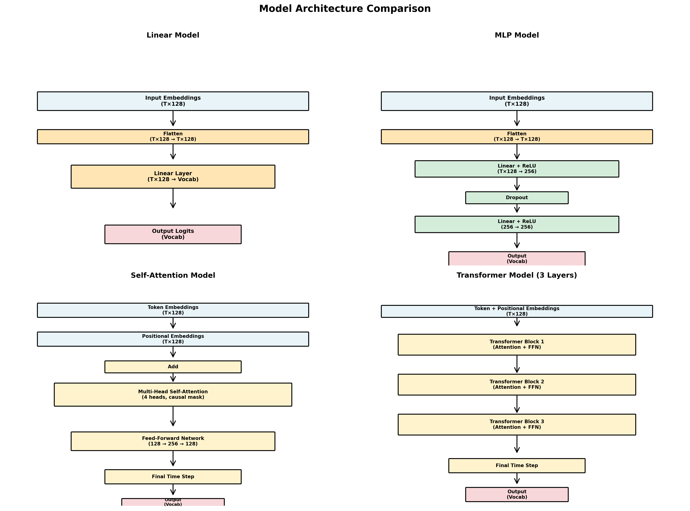
  <p><em>LeNet-style architecture diagrams showing the four model designs</em></p>
</div>

1. **Linear Model**: Multinomial logistic regression over concatenated embeddings
2. **MLP**: Two hidden layers with ReLU activations and dropout
3. **Self-Attention**: Single transformer block with causal multi-head attention
4. **Transformer**: Multi-layer transformer with 3 layers (configurable)

### Hyperparameter Sweeps

The notebook includes hyperparameter sweeps for:
- **Linear**: Context length `{32, 64, 128}`
- **MLP**: Hidden dimension `{128, 256, 512}`
- **Self-Attention**: Number of heads `{1, 2, 4}`
- **Transformer**: Number of layers `{2, 3, 4}`

## Datasets

### Tiny Shakespeare
- **Type**: Character-level language modeling
- **Size**: ~1 MB of text
- **Splits**: Train/validation/test provided
- **Tokenization**: Character-level vocabulary

### Penn Treebank (PTB)
- **Type**: Word-level language modeling
- **Vocabulary**: 9,999 tokens (training split only)
- **Context**: 64 words

### WikiText-2
- **Type**: Word-level language modeling
- **Vocabulary**: 33,277 tokens (training split only)
- **Context**: 64 words

## Results

### Training Curves

#### Tiny Shakespeare - All Architectures
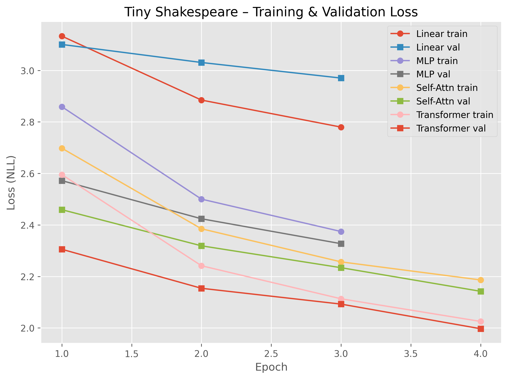

#### Word-Level Models
<div align="center">
  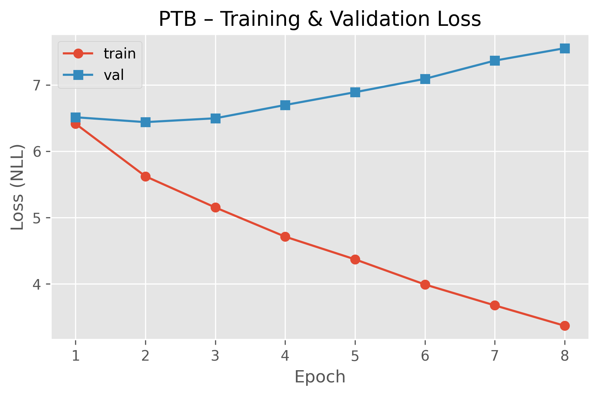
  <p><em>PTB Training and Validation Loss</em></p>
</div>

<div align="center">
  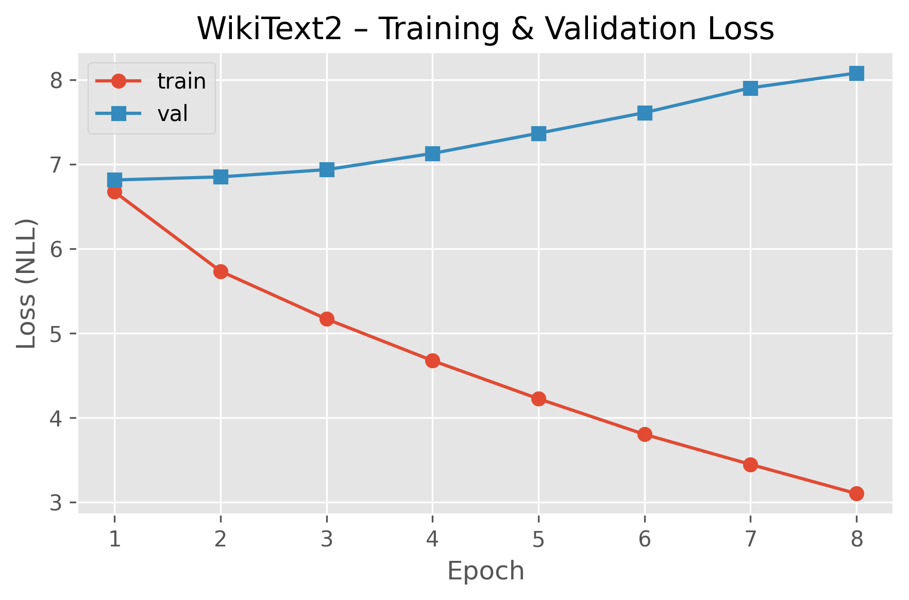
  <p><em>WikiText-2 Training and Validation Loss</em></p>
</div>

### Efficiency Comparisons

#### Character-Level (Tiny Shakespeare)
<div align="center">
  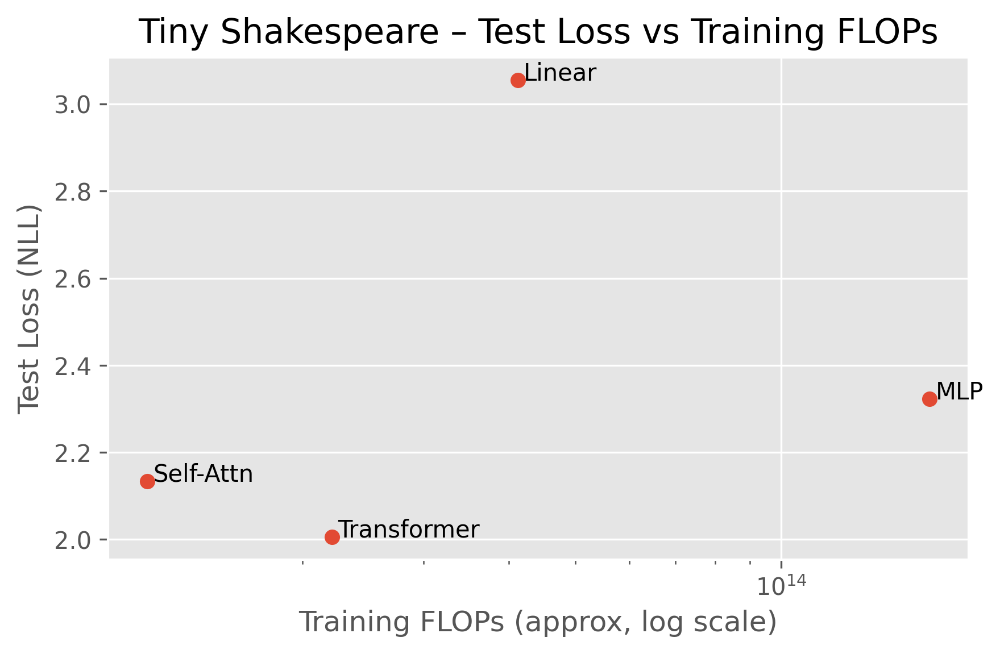
</div>

#### Word-Level Models
<div align="center">
  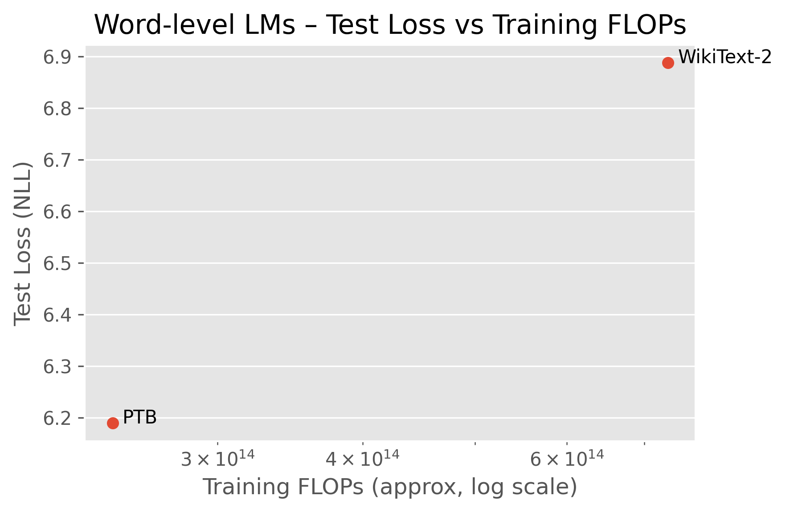
</div>

### Hyperparameter Sweeps

#### Linear Model: Context Length
<div align="center">
  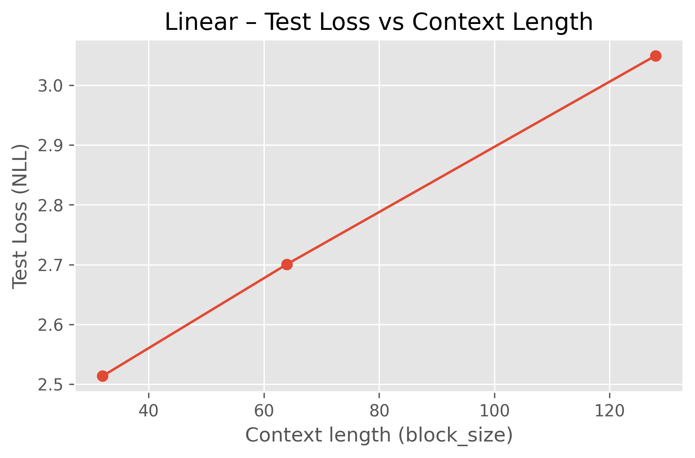
</div>

#### MLP: Hidden Dimension
<div align="center">
  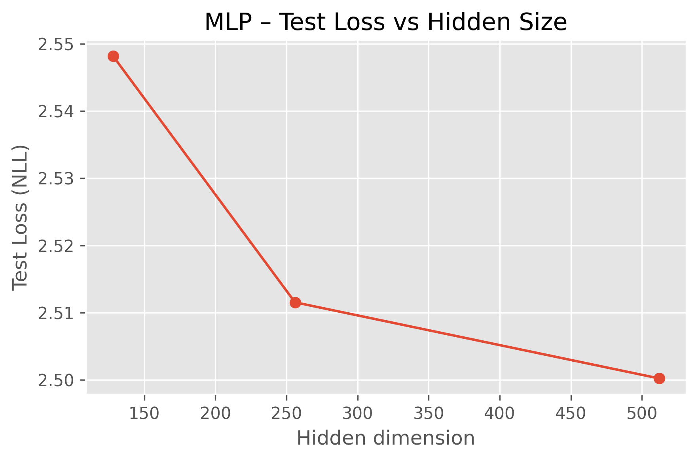
</div>

#### Self-Attention: Number of Heads
<div align="center">
  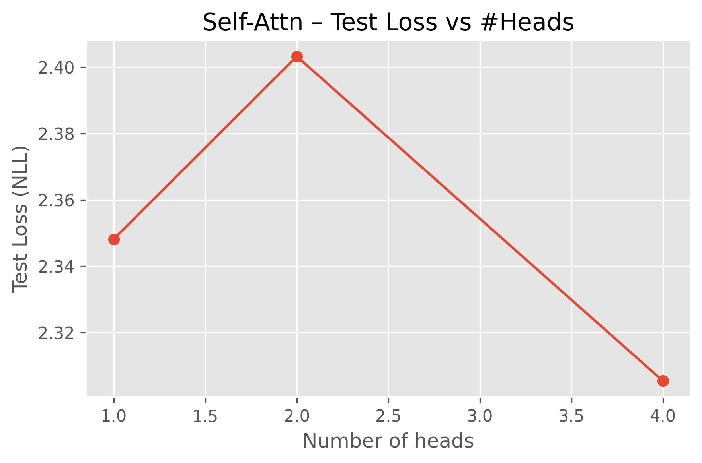
</div>

#### Transformer: Number of Layers
<div align="center">
  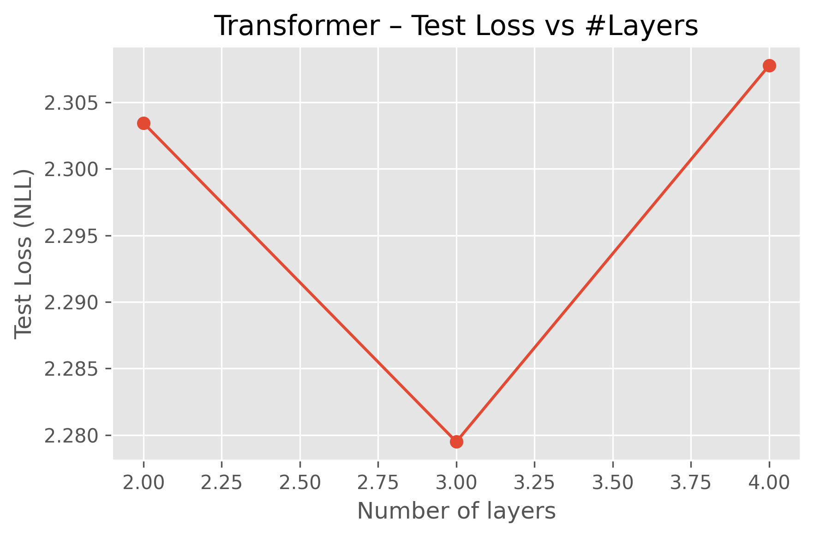
</div>

### RoPE Positional Encoding Comparison

#### Training Dynamics
<div align="center">
  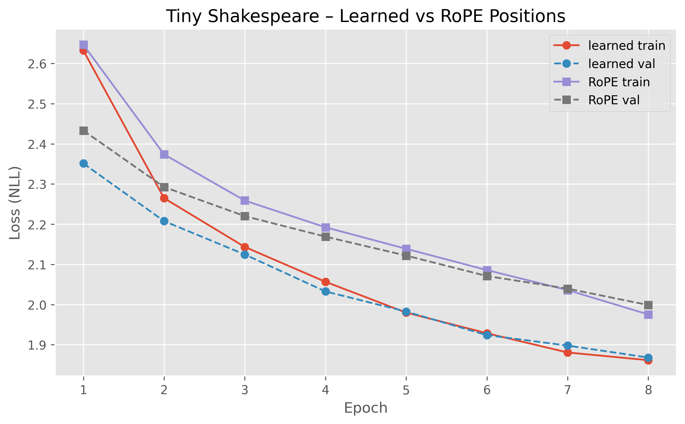
</div>

#### Efficiency Comparison
<div align="center">
  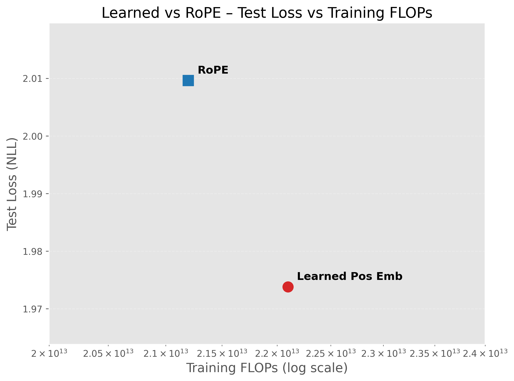
</div>

### Key Results Summary

| Model | Parameters | Test NLL (Tiny Shakespeare) |
|-------|-----------|----------------------------|
| Linear | 1,073,345 | 3.05 |
| MLP | 4,285,377 | 2.32 |
| Self-Attention | 231,617 | 2.13 |
| Transformer | 430,785 | 2.01 |

Attention-based models achieve better performance with fewer parameters and lower compute requirements.

## Citation

If you use this code or findings in your research, please cite:

```bibtex
@article{bhatti2024architectural,
  title={Architectural Trade-offs in Small Language Models Under Compute Constraints},
  author={Bhatti, Shivraj Singh},
  year={2025},
  url={https://github.com/shivraj-S-bhatti/language_model_architecture_comparison}
}
```

## License

This project is provided as-is for research and educational purposes.

## Contact

For questions or issues, please contact:
- **Email**: ssbhatti@umass.edu
- **GitHub**: [@shivraj-S-bhatti](https://github.com/shivraj-S-bhatti)

